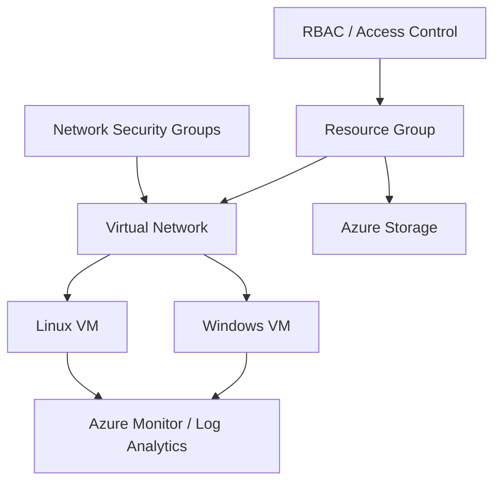

# Microsoft Azure Cloud Infrastructure Lab

Hands-on academic cloud infrastructure case study covering Azure compute, networking, access control, storage, and monitoring.

**Portfolio:** https://devanshujamwal.github.io/Devanshujamwal/projects/azure-infrastructure/

## Overview

This repository documents a non-production Azure learning environment used to build practical understanding of how cloud resources work together. The focus is on infrastructure fundamentals rather than application development: virtual machines, virtual networking, security controls, access management, storage, and operational visibility.

## Objective

Build a clear mental model of how Azure infrastructure components interact so that common connectivity, permissions, and monitoring issues can be approached systematically.

## Architecture

## Technologies

- Microsoft Azure
- Azure Virtual Machines
- Virtual Networks
- Network Security Groups
- RBAC
- Azure Storage
- Azure Monitor
- Log Analytics
- Windows
- Linux

## Implementation

### Compute
Worked with Windows and Linux virtual-machine scenarios to connect operating-system administration with Azure resource management.

### Networking
Practised Virtual Network and subnet concepts together with Network Security Groups to understand how traffic paths and access rules affect connectivity.

### Identity and access
Applied RBAC and governance concepts to understand least-privilege access and the relationship between users, roles, scopes, and resources.

### Storage
Worked with Azure Storage concepts and redundancy options as part of broader cloud infrastructure coursework.

### Monitoring
Used Azure Monitor and Log Analytics concepts to connect infrastructure operation with metrics, logs, and troubleshooting visibility.

## Troubleshooting approach

A structured cloud troubleshooting workflow helps avoid guessing:

1. Confirm the Azure resource is running and in the expected state.
2. Check IP configuration, subnet placement, and route path.
3. Review effective NSG rules and allowed traffic.
4. Check the guest operating system and service state.
5. Verify RBAC scope if the issue is permission-related.
6. Review Azure Monitor and Log Analytics data for operational context.

## Validation

This repository represents academic hands-on work and documents the technologies and troubleshooting methods practised. It does **not** claim production ownership, customer workloads, or results that are not preserved in the lab material.

## What I learned

The main takeaway is that a cloud workload is more than a VM. Networking, identity, security rules, storage, operating-system configuration, and monitoring all affect whether the environment is reachable, secure, and supportable.

## Related skills

Azure · Windows/Linux administration · Networking · Access control · Monitoring · Troubleshooting

## Portfolio

See the complete portfolio and my other technical case studies:

**https://devanshujamwal.github.io/Devanshujamwal/**

---
**Devanshu Jamwal** · IT Support · Systems · Networking · Cloud
