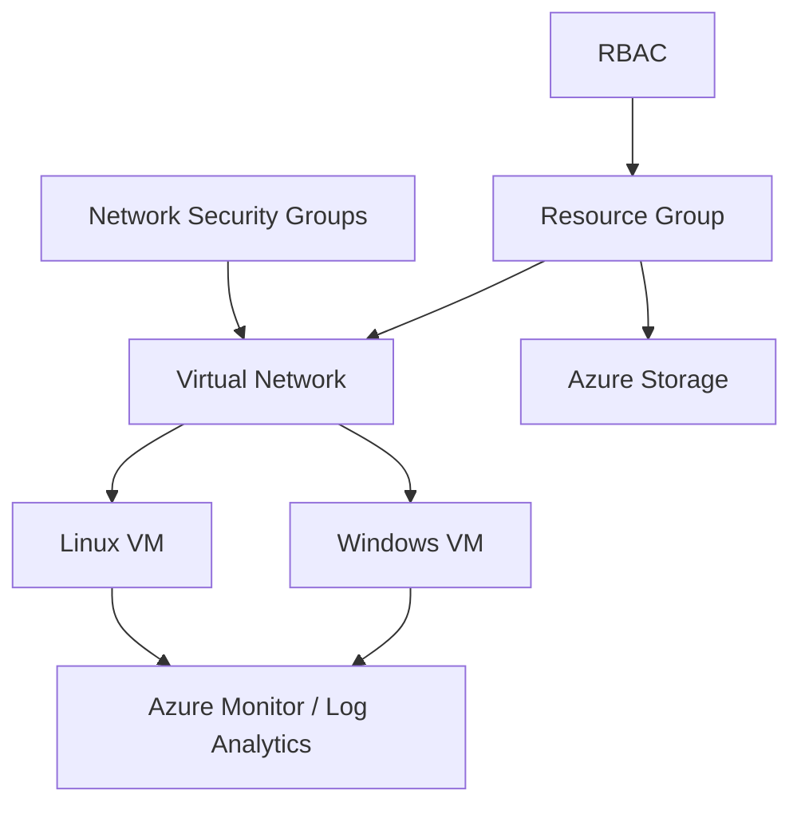

# Microsoft Azure Cloud Infrastructure Lab

A hands-on Azure infrastructure case study focused on **compute, virtual networking, access control, storage, monitoring, and troubleshooting**.

**Portfolio case study:** https://devanshujamwal.github.io/projects/azure-infrastructure/

## At a glance

| Area | Details |
|---|---|
| Environment | Microsoft Azure, non-production academic lab |
| Compute | Windows and Linux virtual machines |
| Networking | VNets, subnet concepts, NSGs |
| Access | RBAC and governance concepts |
| Observability | Azure Monitor and Log Analytics |

## Architecture

## What I worked on

- Windows and Linux virtual-machine scenarios.
- Virtual Networks, subnet concepts, and Network Security Groups.
- RBAC and least-privilege access concepts.
- Azure Storage and redundancy concepts.
- Azure Monitor and Log Analytics fundamentals.
- Connecting cloud configuration with operating-system troubleshooting.

## Troubleshooting approach

I separate cloud issues into layers:

1. Resource state
2. Network path
3. NSG rules
4. Guest operating system
5. Permissions / RBAC
6. Monitoring and logs

This prevents a permission issue from being mistaken for a connectivity issue—or vice versa.

## Skills demonstrated

**Cloud:** Azure VMs, VNets, NSGs, Storage, RBAC, Monitor, Log Analytics  
**Systems:** Windows, Linux  
**Operational skills:** Access-control reasoning, layered troubleshooting, monitoring awareness

## Documentation

- [Architecture notes](./docs/architecture.md)
- [Azure troubleshooting playbook](./docs/troubleshooting-playbook.md)

## Scope

This repository represents academic hands-on work. It does **not** claim ownership of production subscriptions, customer workloads, or undocumented deployment results.

## What I learned

A cloud workload is more than a VM. Networking, permissions, operating-system state, storage, and observability all affect whether infrastructure is secure, reachable, and supportable.

## Next improvements

A future version could include sanitized deployment screenshots, resource diagrams, and repeatable validation steps from a fresh lab environment.

---
**Devanshu Jamwal** · IT Support · Systems · Networking · Cloud  
[Portfolio](https://devanshujamwal.github.io/) · [GitHub Profile](https://github.com/Devanshujamwal)
